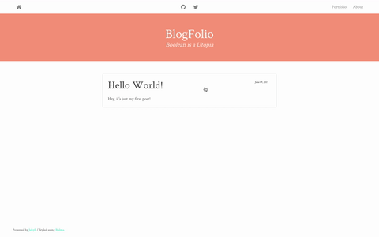

#  Jekyll Theme - BlogFolio

A simple and easy to use blog and portfolio theme for Jekyll

##  Install
1. Clone or download `https://github.com/lamccloskey/jekyll-theme-blogfolio.git`
2. Enter folder `cd jekyll-theme-blogfolio/`
3. Start Jekyll Server `jekyll serve`
4. Enter url `localhost:4000/jekyll-theme-blogfolio/`

##  Demo
[https://lamccloskey.github.io/jekyll-theme-blogfolio/](https://lamccloskey.github.io/jekyll-theme-blogfolio/)

##  Preview

---
_Powered by [Jekyll](http://jekyllrb.com/) and styled using [Bulma](http://bulma.io/)_

# 프로젝트 이름

   
  
   

목차

## 프로젝트 소개

프로젝트 개요/동기

GIF Images

 

## 기술 스택

| JavaScript | TypeScript |  React   |  Node   |
| :--------: | :--------: | :------: | :-----: |
|   ![js]    |   ![ts]    | ![react] | ![node] |

 

## 구현 기능

### 기능 1

### 기능 2

### 기능 3

### 기능 4

 

## 배운 점 & 아쉬운 점

 

## 라이센스

MIT &copy; [NoHack](mailto:lbjp114@gmail.com)

<!-- Stack Icon Refernces -->

[js]: /images/stack/javascript.svg
[ts]: /images/stack/typescript.svg
[react]: /images/stack/react.svg
[node]: /images/stack/node.svg
